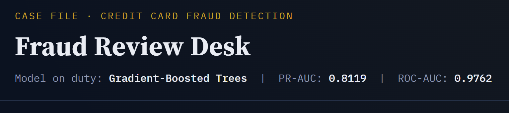
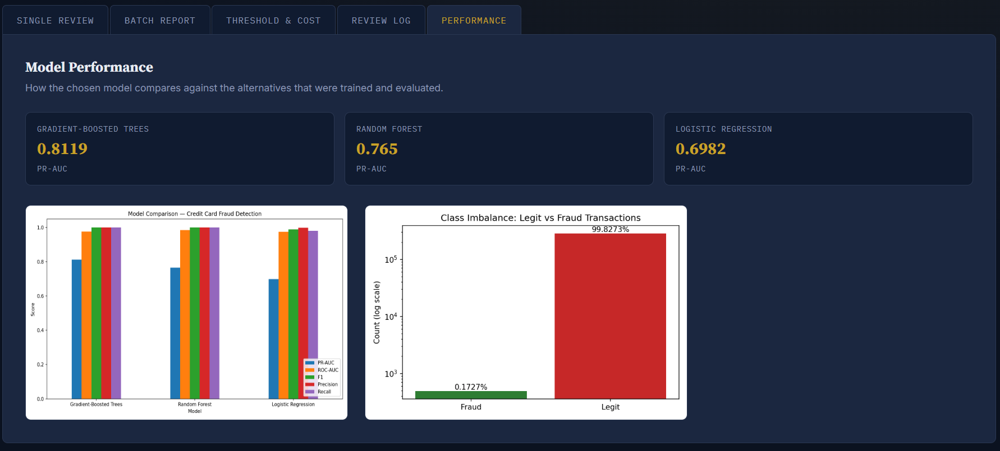
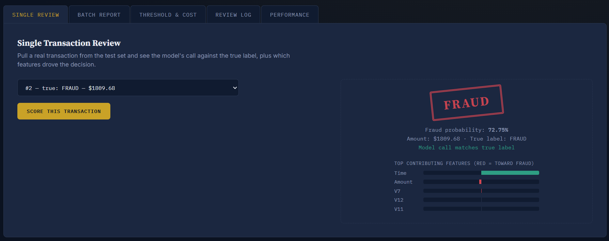
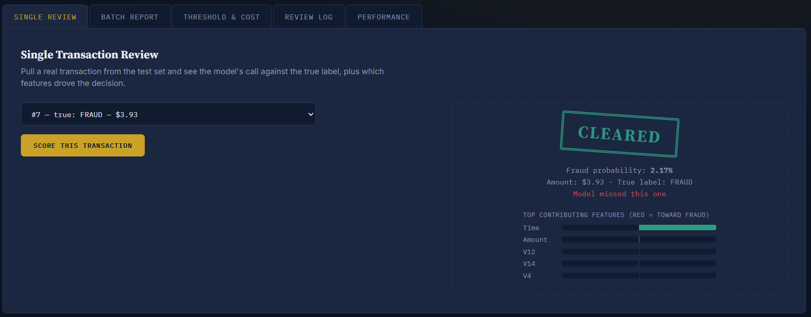
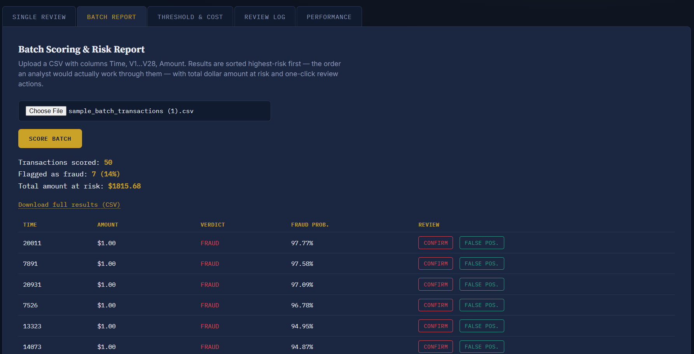
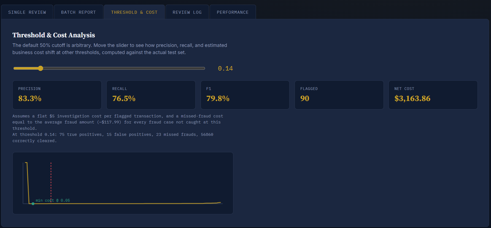
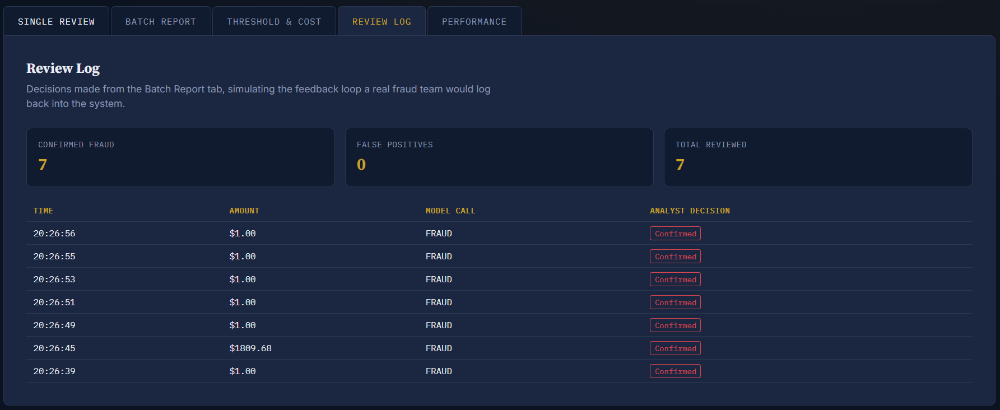

# Fraud Review Desk

**A PySpark fraud detection pipeline with a decision-support dashboard — not just a model, but a tool an analyst could actually use to triage transactions, tune the cost/risk tradeoff, and track review decisions.**

---

## Why this exists

Most fraud-detection demos stop at "here's a model that predicts fraud/not-fraud." That's not actually useful on its own — a fraud team doesn't need a label, it needs to know **what to do** with that label: which transactions to work first, where to set the cutoff given real costs, and why the model flagged what it flagged.

This project is built around that gap. It has three parts:

1. A **PySpark pipeline** that trains and compares three classifiers on real, extremely imbalanced fraud data.
2. An **honest evaluation** using metrics that actually matter at 0.17% positive-class prevalence (PR-AUC, not accuracy).
3. A **custom-built Flask dashboard** — not a bare API, not an off-the-shelf widget library — designed around actual fraud-analyst workflows: review, triage, cost tradeoffs, and a feedback loop.

---

## The dataset

[Credit Card Fraud Detection (ULB)](https://www.kaggle.com/datasets/mlg-ulb/creditcardfraud) — 284,807 European credit card transactions from September 2013, with 492 confirmed fraud cases.

| | |
|---|---|
| Total transactions | 284,807 |
| Fraud cases | 492 |
| Fraud rate | **0.1727%** |
| Legit rate | 99.8273% |

Features `V1`–`V28` are already PCA-transformed by the dataset providers for anonymization. Only `Time` and `Amount` are raw and needed further scaling.

*(Class imbalance shown on the right of the Performance tab — note the log scale; fraud is a sliver of the data.)*

---

## Pipeline overview (Input → Process → Output)

| Phase | What happens |
|---|---|
| **Input** | PySpark ingestion of the raw CSV, schema validation. |
| **Process** | `VectorAssembler` + `StandardScaler` on `Time`/`Amount` (V1–V28 left untouched, already PCA-scaled). Class-imbalance handled via computed sample weights rather than naive oversampling, to avoid distorting the PCA feature relationships. Stratified 80/20 train/test split. |
| **Output** | Three classifiers trained and compared, best one selected by PR-AUC, saved as a Spark `PipelineModel`, and served through the dashboard. |

---

## Model comparison

Three classifiers were trained with identical preprocessing and evaluated on the same held-out test set:

| Model | PR-AUC | ROC-AUC |
|---|---|---|
| **Gradient-Boosted Trees** | **0.8119** | **0.9762** |
| Random Forest | 0.7650 | — |
| Logistic Regression | 0.6982 | — |

**Gradient-Boosted Trees won** and is the model running in the dashboard. PR-AUC — not accuracy — is the deciding metric here: with fraud at 0.17% of transactions, a model that predicts "legit" every single time would score 99.8% accuracy while catching zero fraud. PR-AUC actually measures how well the model separates the rare positive class from the overwhelming majority.

---

## The dashboard

A single-page Flask app styled like a fraud case file — dark ink-navy background, serif/monospace type pairing, and verdicts rendered as a rotated ink stamp rather than a plain badge. It has five tabs, each addressing a different part of an analyst's actual workflow.

### 1. Single Transaction Review

Pull a real transaction from the test set and see the model's call against the true label — plus which features actually drove the decision (top 5 feature contributions, red = pushed toward fraud, green = pushed toward legit).

**A correct catch:**

**An honest miss:**

This second screenshot is worth calling out rather than hiding: a **$3.93** transaction, truly fraudulent, was scored at only 2.17% fraud probability and cleared. This isn't cherry-picked — it's a real and informative failure. Small-dollar fraud like this is a known hard case in fraud detection, often associated with **card testing**, where a stolen card is used for a tiny trial purchase to confirm it's still active before a larger fraudulent charge is attempted. Amount alone doesn't strongly signal fraud in this dataset (the anonymized `V1`–`V28` features carry most of the signal), so very small transactions give the model comparatively little to key off — and it shows here.

Notably, when a batch of test-set fraud cases was scored (see below), **every flagged transaction was a $1.00 charge** — consistent with the same card-testing pattern. The model catches most of these, but this single miss shows the pattern's edge cases.

### 2. Batch Scoring & Risk Report

Upload a CSV of transactions and score all of them at once, sorted **highest-risk first** — the order an analyst would actually work through a queue — with the total dollar amount at risk surfaced up front, not buried in a table.

In this run: 50 transactions scored, 7 flagged (14%), **$1,815.68 total amount at risk**. Each flagged row has one-click **Confirm** / **False Positive** buttons, feeding into the Review Log (below).

### 3. Threshold & Cost Analysis

The default 50% probability cutoff is arbitrary. This tab makes the cutoff a live, tunable business decision instead of a hidden constant.

The cost model is stated explicitly in the UI, not hidden:
- **$5** assumed flat cost to investigate one flagged transaction
- **~$118** (the dataset's average fraud amount) assumed lost for every fraud case missed at a given threshold

**Net cost = (flagged transactions × $5) + (missed frauds × avg fraud amount)**

Sweeping every threshold from 0.01 to 0.99 against the actual test set found the lowest-cost threshold at **0.05** — net cost **$2,778.89** — versus **$3,442.84** at the default 0.5 cutoff. That's roughly **$664 saved on this test set alone** just by setting the cutoff correctly instead of trusting the default. This is the single number in this project that best demonstrates thinking about the business problem, not just the model.

### 4. Review Log

Every Confirm / False Positive decision made in the Batch tab is logged here — a lightweight stand-in for the feedback loop a real fraud system uses to retrain and improve over time.

*(Session-only — this log resets if the Colab runtime restarts. A production version would persist this to a database.)*

### 5. Performance

The metrics table and comparison charts from model training, embedded directly so the dashboard also documents *why* this model was chosen.

---

## Explainability — an honest note

The "top contributing features" shown in Single Review use different methods depending on which model wins, and this project treats that difference honestly rather than overclaiming:

- **If Logistic Regression wins:** contributions are an **exact** decomposition — each feature's scaled value multiplied by its model coefficient, which is literally what produces the logit.
- **If a tree-based model (Random Forest / GBT) wins**, as it did here: contributions are an **approximation** — global feature importance multiplied by how far the transaction's value deviates from the average legit transaction. This is a reasonable, interpretable heuristic, but it is **not SHAP** and doesn't carry the same theoretical guarantees. Framed accurately in conversation (e.g. an interview), not as "SHAP-based explainability."

---

## Tech stack

- **PySpark** (MLlib) — ingestion, feature engineering, model training, class-weighting
- **Flask** — custom dashboard backend, REST-style JSON endpoints
- **HTML/CSS/JS** — hand-built frontend (no framework), canvas-based cost curve
- **ngrok** — public tunnel for demoing the dashboard from Colab
- **Google Colab** — training and hosting environment
- **Colab Secrets** — credential storage (Kaggle API + ngrok token), never hardcoded or committed

---

## Running this yourself

1. Open the notebook in Google Colab.
2. Add three secrets via the key icon in the left sidebar:
   - `KAGGLE_USERNAME`, `KAGGLE_KEY` (from kaggle.com → Account → API)
   - `NGROK_AUTH_TOKEN` (from dashboard.ngrok.com)
3. Run all cells top to bottom. The dataset downloads automatically, models train and compare, and the dashboard launches with a public ngrok URL printed at the end.
4. To test batch scoring, export a CSV of real feature columns (`Time`, `V1`...`V28`, `Amount`) from the test set — no `Class` column, since that's the answer key.

---

## Known limitations

- The cost assumptions ($5 investigation cost, avg-fraud-amount-as-loss) are reasonable illustrative figures, not researched business figures — worth stating plainly if asked, rather than presenting them as validated.
- The Review Log is in-memory only; it doesn't persist across sessions.
- Tree-model explainability is an approximation, not true SHAP.
- The model has a real, demonstrated blind spot on very small-dollar fraud (see the $3.93 miss above) — consistent with card-testing fraud being genuinely hard to catch on amount/PCA-feature signal alone.

## Possible next steps

- Persist the Review Log to a real database so the feedback loop survives restarts.
- Add true SHAP values for tree models (would require exporting to a SHAP-compatible framework, since Spark ML models aren't natively supported).
- Retrain periodically using confirmed/false-positive labels from the Review Log, closing the feedback loop for real rather than just logging it.
